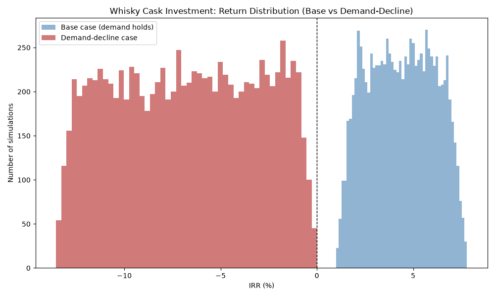
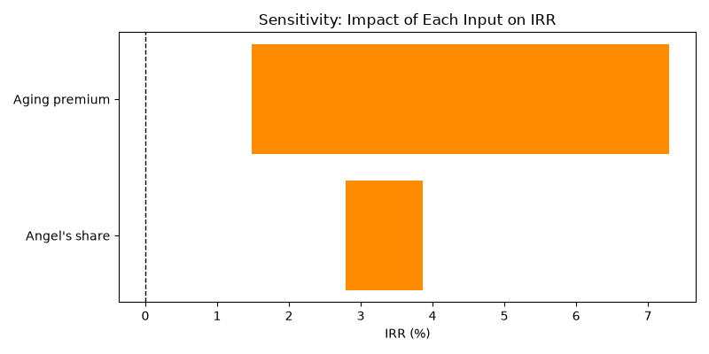
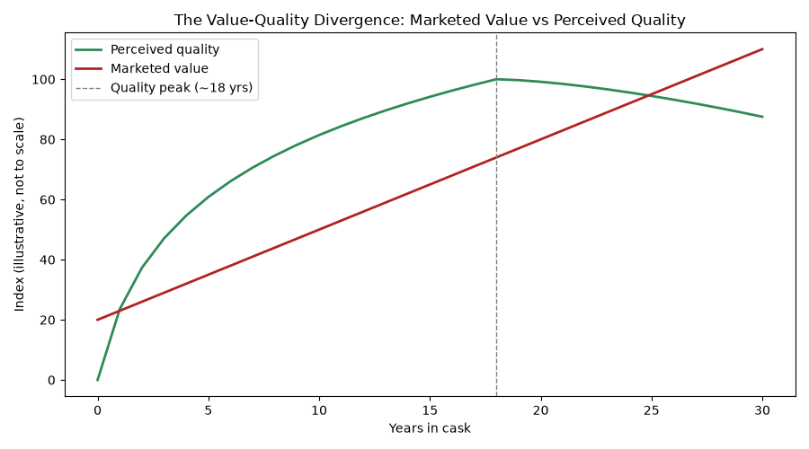

# Should You Buy a Whisky Cask?

*A Monte Carlo model of cask returns for an Indian buyer — Akhila Nayak*

## Verdict up front

Every cask company's pitch reads about the same. Whisky gets better with age, so does the price, buy one and forget about it till the number looks good. I wanted to know if that's actually true or just plausible, so I built a model and ran it 10,000 times, once assuming whisky demand holds up, once assuming it doesn't. The second scenario isn't hypothetical for effect. Scotch auction values dropped 53% between late 2024 and early 2025.

There's barely a middle case. Demand holds, average return lands around 4.4% a year, mostly between 1.7% and 7%. Fine. A little boring, honestly. Never negative, not once across 10,000 runs. Demand goes the other way and every single run loses money, -6.8% on average. Not smaller gains. Losses, all 10,000 times.

My actual take: small allocation, yes, if the rest of your portfolio is already solid and you can lock the money away for ten years without checking on it. Anything bigger than small, no. I'd be wary of anyone selling this to you as safe. There's also a piece of this specific to buying from India that the marketing never touches, since it's written for UK buyers. India doesn't recognise the UK's tax exemption on cask gains. You're taxed here regardless of what the seller's brochure claims, and your return also rides on the rupee-pound rate for however long you hold, a variable a UK buyer never has to think about.

## What you're actually buying

Scotch has a legal minimum, three years in an oak cask, in Scotland, or it doesn't get to use the name. Anything worth having sits far longer than that. Eighteen years isn't unusual. Nobody's drinking it during that time, nobody's even opening the barrel. What actually moves is ownership on paper, while the liquid sits in a warehouse doing nothing at all.

Nearly every platform selling this is UK-based, since Scotch is legally tied to Scottish soil, and they sell to buyers everywhere, India included. Buy a cask for a few thousand pounds, walk away, sell it later for more. That's the whole pitch. It leans on a UK tax break, casks count as a wasting asset there and skip capital gains, and on scarcity, since a cask only holds so much liquid and it's shrinking by the year.

The reason I picked whisky specifically instead of some other alt-asset is a little personal. During my CA articleship I did consulting work for a wine business, and it left me curious about alcohol as an asset rather than just something people drink. Cask investing turned out to be a genuinely interesting valuation problem once you get past the marketing. No public price. Physical decay built into the product itself. A broker market that almost nobody outside it actually understands.

What the pitch leaves out is everything working against it. The whisky evaporating year after year. Storage and insurance bills that don't stop. No real place to sell when you're ready, no exchange, just a broker and whatever they think they can get. And a demand assumption, that people fifteen years from now want whisky as much as people do today, which is the actual thing this model tests.

## The model

One 500-litre new-fill hogshead. Roughly ₹4,00,000, which is what UK brokers are actually charging for this size right now, not a number picked to make the arithmetic convenient. Tracked year by year across a 12-year hold: liquid left after evaporation, price per litre as it ages, storage and insurance stacking up.

Two numbers here don't have a single correct value. How fast the whisky evaporates, and how fast price climbs. Nobody can pin those down exactly, so rather than pick one number and defend it as fact, each simulated run draws its own value from a realistic range, then the whole thing runs 10,000 times. Early on the output came back showing a -26% IRR, which made no sense until I noticed the purchase price and the per-litre value were sitting on completely different scales without my having caught it. Took a while staring at the numbers before that clicked.

Two versions ran once that was fixed. A base case, prices climbing the way they historically have. A demand-decline case, where that range shifts down to match the actual 53% auction drop from late 2024 into early 2025.

Every simulated year, the model also checks alcohol strength. Below 40%, legally, it's no longer Scotch. Not a discount. A zero. Cross that line during a run and the payout drops to nothing instead of following the usual math.

At exit: a 10% broker commission, a 5% haircut for the fact that there's no real market to sell into, plus every rupee spent on storage and insurance along the way. Whatever's left feeds into an IRR calculation, across all 10,000 runs.

None of these ranges are gospel, worth saying plainly. Sourced what I could, estimated the rest. A real cask would need its own paperwork, not a plausible range borrowed from broker websites. Indian capital gains and GBP/INR movement aren't priced in either, and both would shift the real, after-tax number somewhere this model doesn't currently go. Full sourcing for every assumption is in [`data/sources.md`](./data/sources.md).

## What actually came out of it

Line up base case against demand-decline and they barely touch.

*Blue sits right of zero. Red sits left of it. Almost nothing in between.*

Base case averages 4.40% a year, ninety percent of runs somewhere between 1.7% and 7%, zero losses out of 10,000 tries. Demand-decline averages -6.8%, and it isn't close. Every run loses money.

Which input's actually responsible for that split? Tested each one alone, everything else held at a midpoint, moving just that one variable across its range.

*Angel's share barely twitches. Aging premium does the real work.*

Angel's share, the evaporation rate everyone mentions first, barely moves return, maybe a point across its range. Aging premium swings it by nearly six points on its own. Which is a little funny, because marketing talks about evaporation constantly, probably because a barrel sweating away in a warehouse photographs well. The number actually deciding your outcome is the boring one nobody can promise you: how fast price climbs.

One more chart, and this one's more of an argument than a result. The gap between how good the whisky gets and what people say it's worth.

*Quality peaks and drifts down after 18 years. Value doesn't get the memo.*

Quality climbs fast early, flattens near year 18, then slips a little as over-oaking sets in past that point. Marketed value ignores all of it and keeps climbing in a straight line, because older sounds like it should cost more. This one's illustrative, not pulled from the simulation data, but it's pointing at something real. Past a certain age you might be paying more for something arguably getting worse, not better.

## What nobody puts on the homepage

Broker sites lead with heritage, awards, some story about the founding distiller. The numbers that actually decide whether you make money don't show up anywhere near the front page.

Evaporation gets talked about the most and matters the least. At Scotland's usual 1.5-2.5% a year, it moves final return by about a point. Real cost. Small lever.

The ABV cliff is rarer, and total when it lands. Below 40% strength, no longer Scotch, no partial credit. A 10-15 year hold barely comes near that line in the model. Push past 20 years, or store somewhere hot, and it stops being theoretical.

Illiquidity sounds abstract right up until you're the one trying to sell. No exchange. You go through a broker and accept less than book value to actually close the deal. Used 5% and 10% here, though real numbers depend entirely on who's buying and how badly you need out at the time.

Demand is where this actually breaks. Scotch auction values fell 53% between late 2024 and early 2025. Run something like that through the model and every simulation loses money, not most. Younger drinkers reportedly moving away from whisky in general makes this look less like a rough quarter and more like a trend with years left to play out.

An Indian buyer picks up costs a UK brochure never has to mention, because they don't apply to a UK buyer. Sending money out under the RBI's Liberalised Remittance Scheme means a 20% Tax Collected at Source above ₹7 lakh, upfront, claimable back later against your tax bill but tying up cash meanwhile. The UK's capital-gains exemption, the actual centerpiece of most cask marketing, doesn't travel here. Indian capital gains apply regardless, the asset needs declaring under Schedule FA, and skipping that lands you under the Black Money Act. Then there's the rupee-pound rate, moving for or against you the entire hold, real but unpriced in this model.

One more risk no spreadsheet captures. Trusting a broker you've never met, for an asset you can't inspect, sitting in a warehouse on another continent. This exact market has had fraud cases before. No ticker to check your price against, just whatever the broker says it's worth that day.

## Would I buy one

Small amount, yes. Core holding, not close.

If the rest of your portfolio is already solid, a cask's a reasonable way to hold something uncorrelated to equities, as long as you can lock the money away for a decade and shrug if it goes nowhere. Base case here is real, 4.4% isn't nothing, and it never went negative across 10,000 tries.

But the downside case isn't some worst-case scenario dreamed up to sound responsible. It already happened, in the last two years, in the actual market. Run that through the model and you lose money every single time, not sometimes. Stack Indian tax exposure and currency risk on top, and "tax-free, guaranteed growth" stops being an honest way to describe what's being sold.

Go in small, if at all. Money you genuinely won't need for a decade. And go in knowing the entire pitch assumes people still want to drink whisky fifteen years from now, which happens to be the one thing nobody selling you a cask can actually guarantee.
